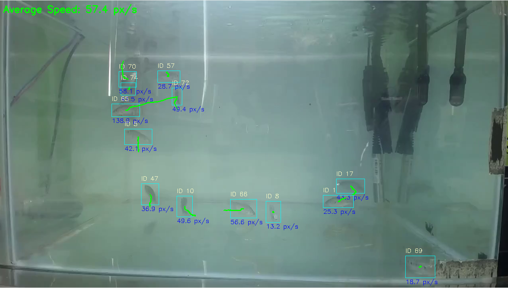

# Aqua Tilapia Detection and Tracking



This project provides a solution for detecting and tracking Tilapia fish in video streams, calculating their movement and speed. It leverages state-of-the-art object detection (YOLO) and multi-object tracking (SORT) algorithms to provide real-time insights into fish behavior.

## Features

- **Tilapia Detection:** Utilizes a pre-trained YOLO model (`best.pt`) to accurately detect Tilapia fish in video frames.
- **Multi-Object Tracking:** Employs the SORT (Simple Online and Realtime Tracking) algorithm to maintain consistent IDs for individual fish across frames, enabling trajectory and speed analysis.
- **Speed Calculation:** Calculates and displays the instantaneous speed of each tracked fish, as well as the average speed of all detected fish.
- **Data Logging:** Records fish positions over time to a CSV file.
- **Visualizations:** Generates plots for average fish speed over time and individual fish trajectories.
- **Real-time Visualization:** Displays the processed video with bounding boxes, fish IDs, and speed information.

## Technologies Used

- **Python:** The primary programming language.
- **Ultralytics YOLO:** For efficient and accurate object detection.
- **SORT (Simple Online and Realtime Tracking):** For robust multi-object tracking.
- **OpenCV (`cv2`):** For video processing and visualization.
- **Numpy:** For numerical operations.
- **Matplotlib:** For generating plots.

## Project Structure

```
aqua_tilapia_detection/
├── .gitignore
├── README.md
├── requirements.txt
├── archive/                      # Potentially older versions or related utilities
│   ├── average_speed_over_time.png
│   ├── centroid.py
│   └── sort.py
├── assets/                       # Sample video assets
│   └── video_shorter.mp4
├── images/                       # Example images
│   └── example_tracking.png
├── models/                       # Pre-trained YOLO model
│   └── best.pt
├── result/                       # Output directory for generated data and plots
│   ├── average_speed_over_time.png
│   ├── fish_positions.csv
│   └── fish_trajectories.png
├── src/                          # Source code
│   ├── data_handler.py           # Handles data saving and plotting
│   ├── main.py                   # Main script to run the detection and tracking
│   ├── sort.py                   # Implementation of the SORT tracking algorithm
│   ├── utils.py                  # Utility functions (e.g., distance calculation)
│   ├── video_processor.py        # Core logic for video processing, detection, and tracking
│   └── result/                   # Output directory for generated data and plots within src
│       ├── average_speed_over_time.png
│       ├── fish_positions.csv
│       └── fish_trajectories.png
└── train/                        # Training scripts and related files
    └── train.py                  # Script for downloading dataset and training YOLO model
```

## Setup and Installation

1.  **Clone the repository:**

    ```bash
    git clone <repository_url>
    cd aqua_nila/aqua_tilapia_detection
    ```

    (Note: Replace `<repository_url>` with the actual repository URL if this project is part of a larger Git repository.)

2.  **Install dependencies:**
    It is recommended to use a virtual environment.

    ```bash
    pip install -r requirements.txt
    ```

    (This will install necessary libraries such as Ultralytics YOLO, OpenCV, NumPy, and Matplotlib.)

3.  **Download the YOLO model:**
    Ensure that `models/best.pt` is available. If not, you will need to train your own YOLO model or download a pre-trained one compatible with your detection task.

## Usage

To run the fish detection and tracking:

```bash
python src/main.py
```

The script will:

1.  Process the video specified in `VIDEO_PATH` (default: `assets/video_shorter.mp4`).
2.  Display a real-time window showing the tracked fish.
3.  Save fish position data to `result/fish_positions.csv`.
4.  Generate `result/average_speed_over_time.png` and `result/fish_trajectories.png`.

## Configuration

You can modify the following constants in `src/main.py` to adjust the behavior:

- `TRACK_TIME_WINDOW`: The time window (in seconds) for calculating fish speed and trajectory trails.
- `SKIP_FRAME`: Number of frames to skip between processing to speed up inference.
- `VIDEO_PATH`: Path to the input video file.
- `MODEL_PATH`: Path to the YOLO model (`.pt` file).
- `OUTPUT_CSV`: Path for the CSV file logging fish positions.
- `OUTPUT_GRAPH_SPEED`: Path for the average speed graph.
- `OUTPUT_GRAPH_TRAJECTORY`: Path for the fish trajectories graph.

## Training the Model

```
If you do not have a pre-trained model for detecting fish, you will need to train one. The following section outlines the process for training a custom YOLO model.
```

The `train/train.py` script provides a streamlined process for training a custom YOLO (You Only Look Once) object detection model. This is crucial for adapting the detection capabilities to specific types of fish or unique environmental conditions in your video streams. The script handles both dataset acquisition from Roboflow and the subsequent model training.

### 1. Prerequisites

Before running the training script, ensure you have the following:

- **Roboflow Account and Project:** You need an active Roboflow account with a workspace and a project containing your annotated dataset. This dataset will be used to train your custom model.
- **Roboflow API Key:** Obtain your personal API key from your Roboflow account settings. This key is required for the script to authenticate and download your dataset.
- **Python Dependencies:** Install the necessary Python libraries, `ultralytics` (for YOLO model training) and `roboflow` (for dataset interaction). If you haven't already, install them using pip:
  ```bash
  pip install ultralytics roboflow
  ```

### 2. How the Training Process Works

The `train/train.py` script executes a two-phase process:

#### Phase A: Dataset Download

- The script connects to the Roboflow platform using the provided API key, workspace name, project name, and dataset version number.
- It downloads your specified dataset, by default in the `YOLOv11` format, which is optimized for YOLO models.
- The downloaded dataset includes images, annotations, and a `data.yaml` configuration file that points to the dataset's structure.

#### Phase B: YOLO Model Training

- Once the dataset is ready, the script initializes a YOLO model (e.g., `yolo11s.pt` as a base).
- It then starts the training process, iterating over the dataset for a specified number of `epochs`.
- During training, the model learns to identify the objects (e.g., Tilapia fish) defined in your dataset's annotations.
- Various parameters like `imgsz` (image size), `batch` (batch size), and `patience` (for early stopping) can be configured to optimize the training performance and prevent overfitting.

### 3. Usage Instructions

To start training your model, navigate to the `train` directory in your terminal and execute the `train.py` script. You **must** provide your Roboflow API key, and you can customize the training process using various optional arguments.

```bash
python train/train.py --api_key YOUR_ROBOFLOW_API_KEY [OPTIONAL_ARGUMENTS]
```

#### Required Argument:

- `--api_key`: **(String)** Your unique Roboflow API Key. This is mandatory for authenticating and downloading your dataset.

#### Optional Arguments:

- `--workspace`: **(String)** The name of your Roboflow workspace.
  - _Default:_ `transferlearning-z9nnr`
- `--project_name`: **(String)** The name of your Roboflow project containing the dataset.
  - _Default:_ `letilapia-igyjs`
- `--version_number`: **(Integer)** The specific version number of your dataset on Roboflow to be downloaded.
  - _Default:_ `3`
- `--dataset_format`: **(String)** The format in which to download the dataset (e.g., `yolov11`).
  - _Default:_ `yolov11`
- `--model_base`: **(String)** The base YOLO model architecture to use for transfer learning (e.g., `yolo11s.pt` for a small model, `yolo11m.pt` for a medium model).
  - _Default:_ `yolo11s.pt`
- `--epochs`: **(Integer)** The total number of training epochs (full passes over the dataset).
  - _Default:_ `200`
- `--imgsz`: **(Integer)** The input image size (width and height) for training, e.g., `640` for 640x640 pixels.
  - _Default:_ `640`
- `--batch`: **(Integer)** The batch size, which determines how many images are processed simultaneously during each training step.
  - _Default:_ `16`
- `--run_name`: **(String)** A custom name for this specific training run. This helps in organizing and identifying the results in the `runs/detect/` directory.
  - _Default:_ `yolov11n_letilapia`
- `--patience`: **(Integer)** The number of epochs to wait for improvement in validation metrics before stopping the training early. This prevents overfitting.
  - _Default:_ `50`

#### Example Command:

Here's an example demonstrating how to run the training script with custom parameters:

```bash
python train/train.py --api_key abcdefg1234567 --workspace my-fish-detection --project_name tilapia-dataset --version_number 5 --epochs 150 --imgsz 800 --batch 32 --run_name custom_tilapia_model
```

### 4. Output and Results

Upon successful completion of the training, the trained model weights will be saved. You can find the `best.pt` (best performing model) and `last.pt` (last epoch's model) files in the following directory structure:

`runs/detect/YOUR_RUN_NAME/weights/best.pt`

For instance, if your `run_name` was `custom_tilapia_model`, the path would be:

`runs/detect/custom_tilapia_model/weights/best.pt`

This `best.pt` file can then be used for inference in your main detection and tracking application.
